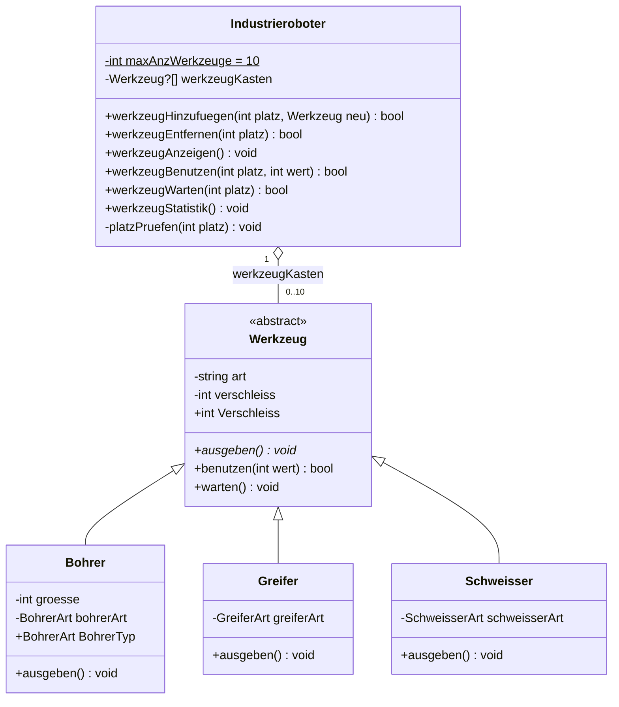

# Industrieroboter – Werkzeugkasten-Verwaltung

Konsolenanwendung in **C# / .NET 9** zur Verwaltung des Werkzeugkastens eines Industrieroboters.
Entstanden als Projektaufgabe in meiner Umschulung – mit Fokus auf objektorientiertem Design,
sauberer Fehlerbehandlung und automatisierten Tests.

## Features

- **Werkzeugkasten mit 10 Plätzen** (0–9), jeder Platz leer oder mit genau einem Werkzeug belegt
- **Drei Werkzeugtypen:** Bohrer, Greifer, Schweisser – jeweils mit eigener Bauform (Enum)
- **Menügeführte Bedienung:**
  1. Werkzeug hinzufügen (mit Untermenü für Typ, Größe und Bauform)
  2. Werkzeug entfernen
  3. Werkzeugkasten anzeigen
  4. Werkzeug benutzen (Verschleiß erhöhen, gedeckelt bei 100 %)
  5. Werkzeug warten (Verschleiß auf 0 % zurücksetzen)
  6. Beenden
  7. Testprogramm (manuelle Testfälle aus der Aufgabenstellung)
  8. Statistik (Ø-Verschleiß, freie/belegte Plätze, am stärksten verschlissenes Werkzeug)
- **15 automatisierte Unit-Tests** mit xUnit

## Klassendiagramm



## Projektstruktur

```
Industrieroboter/
├── Industrieroboter.Domain/     Klassenbibliothek: Werkzeug, Bohrer, Greifer, Schweisser, Industrieroboter
├── Industrieroboter.Konsole/    Konsolenanwendung: Menü und Benutzerinteraktion
├── Industrieroboter.Tests/      xUnit-Tests für das Domänenmodell
└── global.json                  fixiert das .NET 9 SDK
```

Das Domänenmodell kennt weder Konsole noch Tests – Konsole und Tests verweisen beide nur auf `Domain`.

## Starten

Voraussetzung: [.NET 9 SDK](https://dotnet.microsoft.com/download/dotnet/9.0)

```bash
dotnet run --project Industrieroboter.Konsole
```

Tests ausführen:

```bash
dotnet test
```

## Designentscheidungen

- **Abstrakte Basisklasse & Polymorphie:** `Werkzeug.ausgeben()` ist abstrakt; der Werkzeugkasten speichert
  `Werkzeug`-Referenzen, jede Unterklasse gibt sich selbst aus.
- **Verantwortlichkeiten getrennt:** Der Roboter prüft Plätze, das Werkzeug kümmert sich um seinen Verschleiß,
  die Konsole um die Kommunikation mit dem Nutzer.
- **Property als „Türsteher“:** `Verschleiss` hat ein `public get` und ein `private set`, das Werte außerhalb
  von 0–100 mit einer `ArgumentOutOfRangeException` ablehnt – auch schon im Konstruktor.
- **Exceptions vs. Rückgabewert:** Ein nicht existierender Platz ist ein Aufruferfehler und wirft eine
  `ArgumentOutOfRangeException`. Ein belegter bzw. leerer Platz ist ein normaler Geschäftsfall und wird über
  den Rückgabewert `bool` gemeldet.
- **Enums mit Standardwert:** Die Bauform ist ein optionaler Konstruktorparameter, damit bestehende Aufrufe
  gültig bleiben.

## Autor

Marco Ploss
